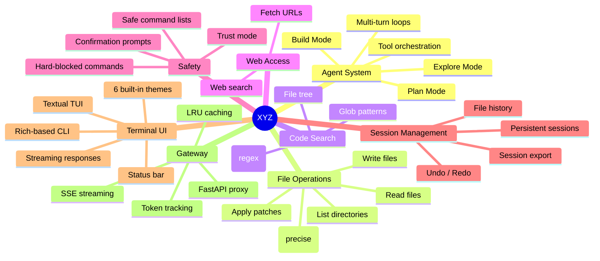
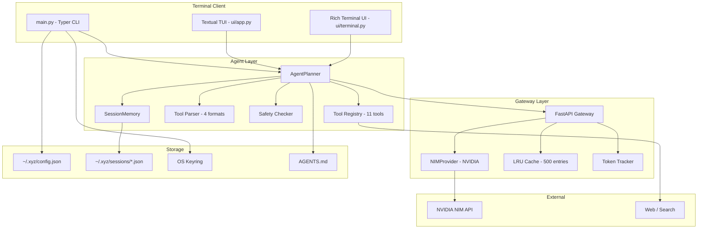
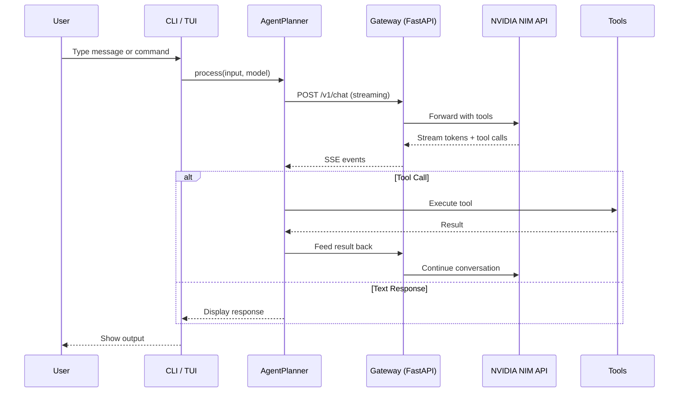
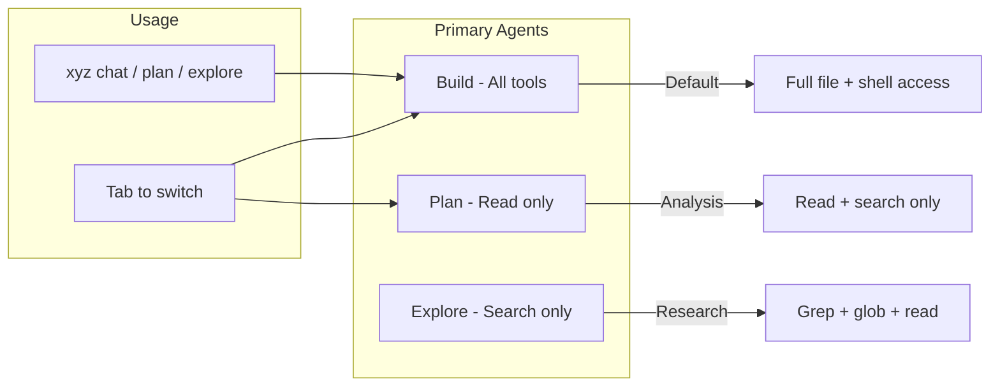
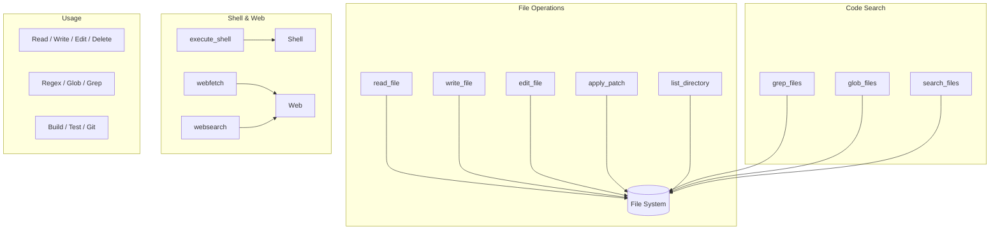
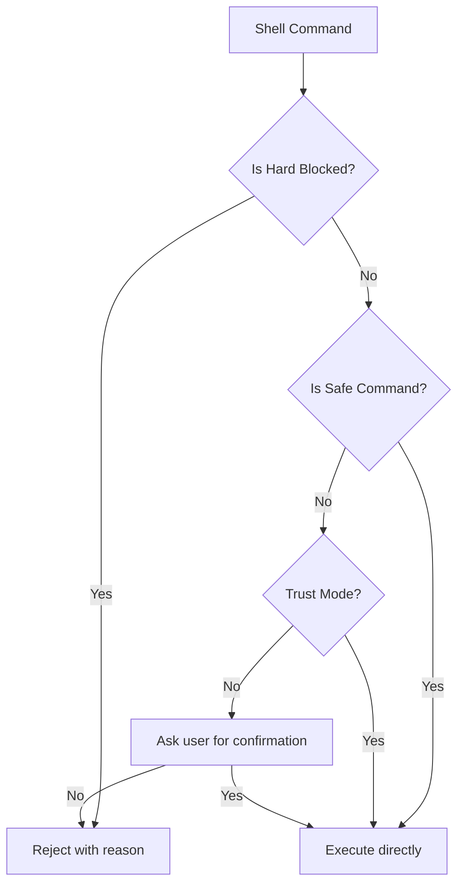
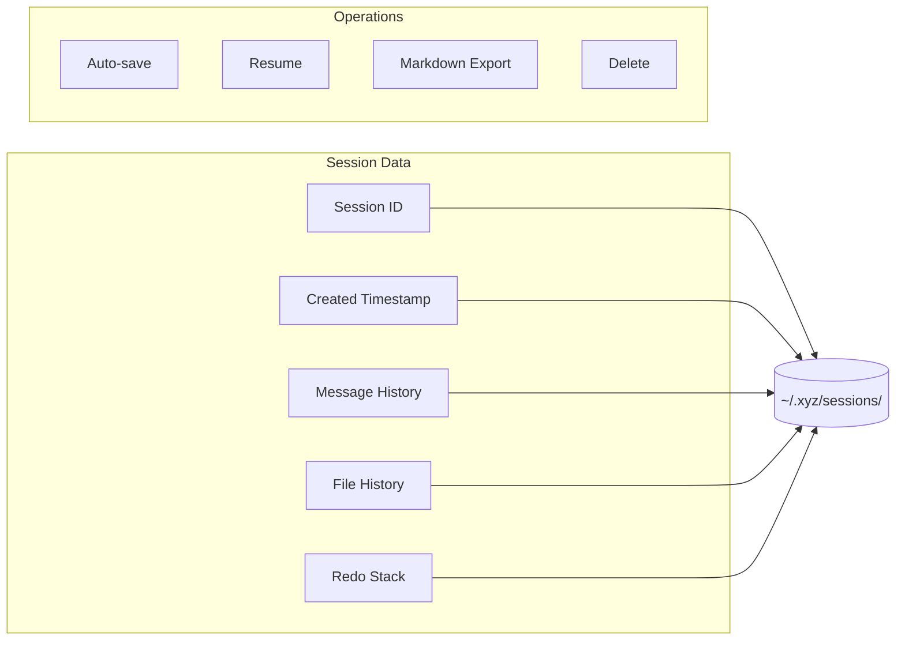
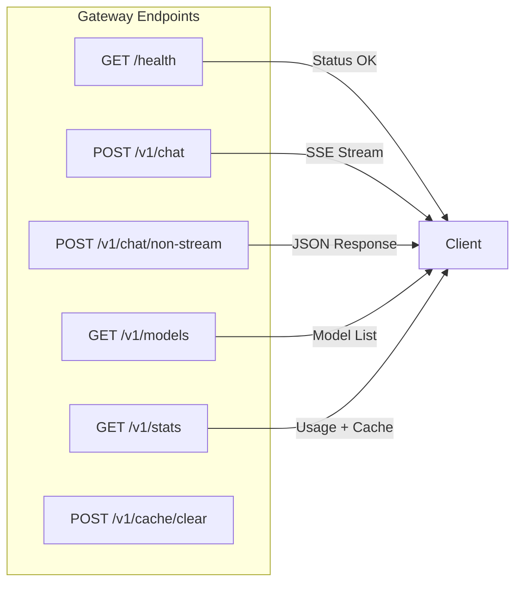

<div align="center">

# XYZ — Open Source AI Coding Agent

**v0.2.0** — *An open source AI coding agent for the terminal, inspired by OpenCode and Claude Code*

[](https://python.org)
[](https://build.nvidia.com)
[](https://fastapi.tiangolo.com)
[](https://rich.readthedocs.io)
[](LICENSE)
[](.github/workflows/ci.yml)

**Created by [Kumar Satyam](mailto:kumarsatyam3135@gmail.com)**

A powerful terminal-based AI coding agent with tool-calling, multi-agent architecture, session memory, streaming responses, and a local FastAPI gateway proxying to NVIDIA's NIM API.

</div>

---

## Table of Contents

- [Overview](#overview)
- [Features](#features)
- [Architecture](#architecture)
- [Project Structure](#project-structure)
- [Installation](#installation)
- [Quick Start](#quick-start)
- [Usage](#usage)
  - [Ask Questions](#ask-questions)
  - [Make Changes](#make-changes)
  - [Undo/Redo Changes](#undoredo-changes)
- [Commands](#commands)
- [Slash Commands](#slash-commands)
- [Agents](#agents)
- [Tools](#tools)
- [Themes](#themes)
- [Safety System](#safety-system)
- [Session Management](#session-management)
- [Gateway API](#gateway-api)
- [Configuration](#configuration)
- [Development](#development)
- [Testing](#testing)

---

## Overview

XYZ is an **open source AI coding agent** that runs in your terminal. It connects to NVIDIA's NIM API to provide an AI-powered assistant that can:

- Read, write, and edit files in your project
- Execute shell commands for builds, tests, git operations
- Search your codebase with regex and glob patterns
- Fetch web content and search the web
- Manage session history with undo/redo
- Operate in multiple agent modes (Build, Plan, Explore)

**Everything runs locally — only the AI inference is remote via NVIDIA NIM.**

---

## Features



---

## Architecture



### Request Flow



---

## Project Structure

```
xyz/
├── main.py              # CLI entry point (Typer) + 30+ slash commands
├── config.py            # Configuration, API key, sessions, exports
├── pyproject.toml       # Modern Python packaging & tool config
├── __init__.py          # Package metadata
├── agent/
│   ├── planner.py       # Agent loop with multi-agent support
│   ├── memory.py        # Session memory with undo/redo
│   ├── parser.py        # Multi-format tool call parser (4 formats)
│   ├── safety.py        # Command safety checker (layered)
│   └── tools.py         # 11 tool implementations & registry
├── gateway/
│   ├── app.py           # FastAPI gateway server (6 endpoints)
│   ├── providers.py     # NVIDIA NIM API provider
│   └── cache.py         # LRU response cache
├── ui/
│   ├── terminal.py      # Rich-based terminal UI
│   ├── themes.py        # 6 theme definitions
│   ├── app.py           # Textual TUI application
│   ├── panels/          # TUI panels (header, chat, input, status)
│   └── widgets/         # TUI widgets (stream text, activity)
├── utils/
│   └── files.py         # Git context & file tree utilities
├── tests/
│   ├── test_tools.py    # Tool function tests
│   ├── test_safety.py   # Safety system tests
│   ├── test_memory.py   # Session memory tests
│   └── test_config.py   # Configuration tests
└── .github/workflows/
    └── ci.yml           # GitHub Actions CI
```

---

## Installation

### Prerequisites

- Python 3.10+
- NVIDIA NIM API key (free at [build.nvidia.com](https://build.nvidia.com))

### Setup

```bash
# Clone the repository
git clone https://github.com/krsatyam36/xyz.git
cd xyz

# Install dependencies
pip install -r requirements.txt

# Install in editable mode
pip install -e .

# Initialize with your API key
xyz init
```

### Dependencies

| Package | Purpose |
|---------|---------|
| `typer` | CLI framework |
| `rich` | Terminal UI rendering |
| `textual` | Full TUI framework |
| `httpx` | Async HTTP client |
| `fastapi` | Gateway server |
| `uvicorn` | ASGI server |
| `pydantic` | Data validation |
| `orjson` | Fast JSON parsing |
| `keyring` | Secure API key storage |
| `prompt_toolkit` | Interactive input |

---

## Quick Start

```bash
# Initialize XYZ (first time only)
xyz init

# Start a chat session (Build mode)
xyz chat

# Plan mode (read-only analysis)
xyz plan

# Explore mode (search codebase)
xyz explore

# Use a specific model
xyz chat --model meta/llama-3.3-70b-instruct

# Resume a session
xyz chat --session abc12345

# Install dev tools
pip install -e ".[dev]"
```

---

## Usage

### Ask Questions

Ask XYZ about your codebase:

```
How is authentication handled in this project?
```

XYZ will read files, grep for patterns, and explain the code to you.

### Make Changes

XYZ can create, edit, and modify files:

```
Add a new route /health that returns {"status": "ok"} to the FastAPI app.
```

It will read the file, make precise edits, and show you what changed.

### Undo/Redo Changes

If a change isn't what you wanted:

```
/undo    # Revert the last file change
/redo    # Restore a reverted change
```

Every file write is tracked in session memory — you can undo multiple changes.

---

## Commands

| Command | Description |
|---------|-------------|
| `xyz init` | Initialize and set up API key |
| `xyz chat` | Start interactive chat (Build mode) |
| `xyz plan` | Start a planning session (read-only) |
| `xyz explore` | Start an exploration session |
| `xyz run` | Start chat (alias for `chat`) |
| `xyz models` | List available models |
| `xyz sessions` | List saved sessions |
| `xyz themes` | List and set themes |
| `xyz undo <id>` | Undo last file write in a session |
| `xyz doctor` | Diagnose installation |
| `xyz version` | Show version info |

### Chat Options

```
xyz chat [OPTIONS]

Options:
  -m, --model TEXT       Model to use
  -s, --session TEXT     Session ID to resume
```

---

## Slash Commands

All commands are fully implemented in chat sessions:

| Command | Description |
|---------|-------------|
| `/help` | Show all available commands |
| `/init` | Create AGENTS.md for the project |
| `/model` | Interactive model picker |
| `/models` | List all available models |
| `/themes [name]` | List or set a theme |
| `/trust [on/off]` | Toggle trust mode |
| `/connect` | Connect a provider |
| `/login` | Sign in with API key |
| `/logout` | Sign out |
| `/sessions` | List saved sessions |
| `/resume <id>` | Resume a session |
| `/new` or `/clear` | New session |
| `/undo` | Undo last file change |
| `/redo` | Redo last undo |
| `/context` | Show repository context |
| `/compact` | Compact session context |
| `/export` | Export conversation to markdown |
| `/config` | Show config paths |
| `/diff` | View uncommitted changes |
| `/doctor` | Diagnose installation |
| `/effort [level]` | Set effort level (auto/low/medium/high/max) |
| `/fast` | Toggle fast mode |
| `/goal <desc>` | Set a session goal |
| `/feedback` | Submit feedback |
| `/focus` | Toggle focus view |
| `/hooks` | View tool hooks |
| `/ide` | IDE integration status |
| `/keybindings` | Show keybindings |
| `/branch` | Branch conversation |
| `/background` | Background session |
| `/btw <question>` | Ask side question |
| `/copy` | Copy last response |
| `/advisor` | Advisor tool status |
| `/agents` | List available agents |
| `/color <name>` | Set prompt color |
| `/share` | Share current session |
| `/unshare` | Unshare session |
| `/add-dir <path>` | Add working directory |
| `/install-github-app` | GitHub App setup |
| `/details` | Toggle execution details |
| `/quit` or `/exit` | Exit XYZ |

---

## Agents

XYZ features a multi-agent architecture with different modes for different tasks:



| Agent | Mode | Description |
|-------|------|-------------|
| **Build** | Primary (default) | Full tool access — read, write, edit, shell, search |
| **Plan** | Primary | Read-only analysis — no file modifications |
| **Explore** | Primary | Search and read only — grep, glob, read |
| **General** | Subagent | Research and multi-step tasks |
| **Compact** | System | Session compaction (auto) |
| **Title** | System | Session title generation (auto) |

Switch between Build and Plan mode by pressing **Tab**, or start directly:
```bash
xyz chat      # Build mode
xyz plan      # Plan mode
xyz explore   # Explore mode
```

---

## Tools

XYZ provides **11 built-in tools** that the AI can use:



### Tool Details

| Tool | Description | Parameters |
|------|-------------|------------|
| `read_file` | Read file contents (with optional line range) | `path`, `offset?`, `limit?` |
| `write_file` | Create or overwrite a file | `path`, `content` |
| `edit_file` | Precise text replacement (CRUD edit) | `path`, `old_string`, `new_string` |
| `apply_patch` | Apply unified diff patches | `patch_text` |
| `list_directory` | List directory entries | `path` |
| `execute_shell` | Run shell command | `command`, `description?`, `timeout?` |
| `grep_files` | Regex search across files | `pattern`, `path?`, `include?` |
| `glob_files` | Find files by glob pattern | `pattern`, `path?` |
| `search_files` | Legacy file search | `pattern`, `path?` |
| `webfetch` | Fetch web page content | `url` |
| `websearch` | Search the web | `query` |

---

## Themes

XYZ ships with **6 built-in themes**:

| Theme | Description |
|-------|-------------|
| **claude** | Claude Code inspired — warm copper/orange tones (default) |
| **midnight** | Deep dark blues and soft whites |
| **obsidian** | Pure dark with warm accents |
| **aurora** | Northern lights inspired greens and purples |
| **solarized** | Classic solarized dark palette |
| **monokai** | Vibrant monokai colors |

Change theme in-chat with `/themes <name>` or via `xyz themes`.

---

## Safety System



### Blocked Categories

- **Destructive**: `rm -rf /`, `mkfs`, `dd`, `format`
- **Privilege Escalation**: `sudo` commands
- **System Control**: `shutdown`, `reboot`
- **Remote Execution**: `curl | bash`, `wget | sh`
- **Fork Bombs**: `:(){ :|:& };:`

### Safe Commands (no confirmation needed)

- `ls`, `pwd`, `cd`, `cat`, `grep`, `find`
- `git status`, `git log`, `git diff`, `git branch`
- `pip install`, `npm install`, `npm run`
- `python`, `python3`, `pytest`, `make`
- `curl`, `wget` (non-piped)

---

## Session Management



Sessions are automatically saved and can be resumed:

```bash
xyz sessions                     # List sessions
xyz chat --session abc12345      # Resume a session
xyz undo abc12345                # Undo from a session
xyz session-delete abc12345      # Delete a session
xyz session-export abc12345      # Export to markdown
```

### File History & Undo/Redo

Every file write and edit is tracked:

```
/undo  # Revert the last file change
/redo  # Restore a reverted change
```

---

## Gateway API

The local gateway runs on a free port (auto-detected):



| Endpoint | Method | Description |
|----------|--------|-------------|
| `/health` | GET | Health check |
| `/v1/chat` | POST | Streaming chat completion (SSE) |
| `/v1/chat/non-stream` | POST | Non-streaming chat completion |
| `/v1/models` | GET | List available NVIDIA NIM models |
| `/v1/stats` | GET | Token usage and cache stats |
| `/v1/cache/clear` | POST | Clear response cache |

### Streaming Protocol

The gateway uses Server-Sent Events (SSE):

```
data: {"type":"token","data":"Hello"}
data: {"type":"token","data":" world"}
data: {"type":"tool_call","data":"{...}"}
data: {"type":"usage","data":"{...}"}
data: {"type":"done","content":"...","tool_calls":[],"usage":{...}}
```

---

## Configuration

Configuration is stored at `~/.xyz/config.json`:

```json
{
  "api_key_set": true,
  "default_model": "meta/llama-3.3-70b-instruct",
  "vision_model": "meta/llama-3.2-90b-vision-instruct",
  "gateway_port": 0,
  "trust_mode": false,
  "theme": "claude",
  "discovered_models": [],
  "effor_level": "auto",
  "fast_mode": false,
  "compact_auto": true,
  "share_enabled": "manual"
}
```

API keys can be set via:
1. **OS Keyring** (default, secure) — `xyz init`
2. **Environment Variable** — `export XYZ_API_KEY=nvapi-...`
3. **`/login` command** — in-chat authentication

### Directory Structure

```
~/.xyz/
├── config.json        # Main configuration
├── sessions/          # Session data (*.json)
├── cache/             # Response cache
├── logs/              # Gateway and app logs
├── providers/         # Provider configs
├── commands/          # Custom commands
├── agents/            # Custom agents
└── themes/            # Custom themes
```

---

## Development

```bash
# Install in editable mode with dev dependencies
pip install -e ".[dev]"

# Install pre-commit hooks
pre-commit install

# Run linting
ruff check xyz/
ruff format xyz/ --check

# Run type checking
mypy --ignore-missing-imports xyz/

# Run tests
pytest tests/ -v

# Run tests with coverage
pytest tests/ --cov=xyz --cov-report=term-missing

# Run directly
python -m xyz.main
```

### Adding a New Tool

1. Add tool definition to `TOOL_DEFINITIONS` in `agent/tools.py`
2. Implement the function in `agent/tools.py`
3. Register in `TOOL_REGISTRY`
4. Update `SYSTEM_PROMPT` in `agent/planner.py`
5. Add to tool names in `agent/parser.py`
6. Write tests in `tests/`

### Adding a New Theme

Add a new `Theme` entry to `THEMES` dict in `ui/themes.py`.

### CI/CD

GitHub Actions workflow runs on push/PR:
- **Lint**: ruff + mypy
- **Test**: pytest on Python 3.10, 3.11, 3.12
- **Coverage**: Report via pytest-cov

---

## Testing

```bash
# Run all tests
pytest tests/ -v

# Run specific test file
pytest tests/test_tools.py -v

# Run with coverage
pytest tests/ --cov=xyz --cov-report=html

# Run safety tests
pytest tests/test_safety.py -v
```

---

<div align="center">

**Created with by [Kumar Satyam](mailto:kumarsatyam3135@gmail.com)**

[GitHub](https://github.com/krsatyam36/xyz) | [Report Issue](https://github.com/krsatyam36/xyz/issues)

</div>
