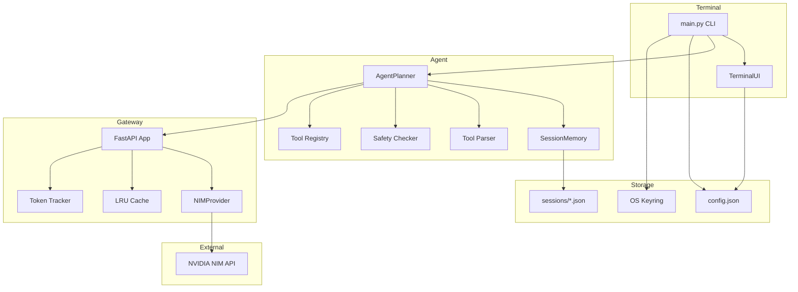
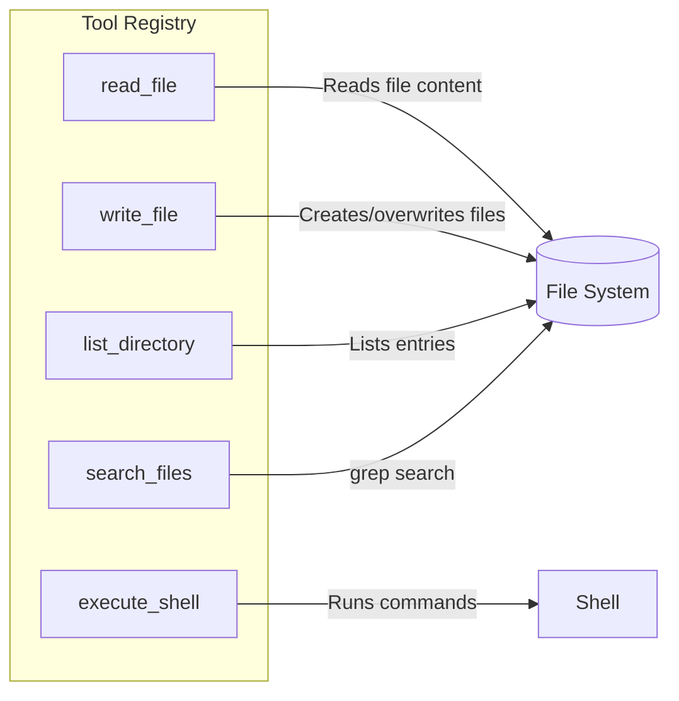
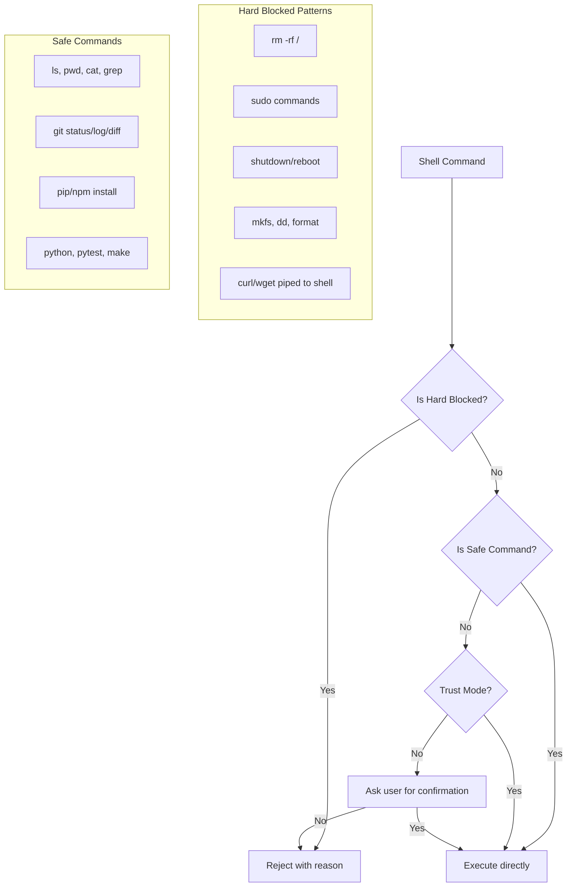
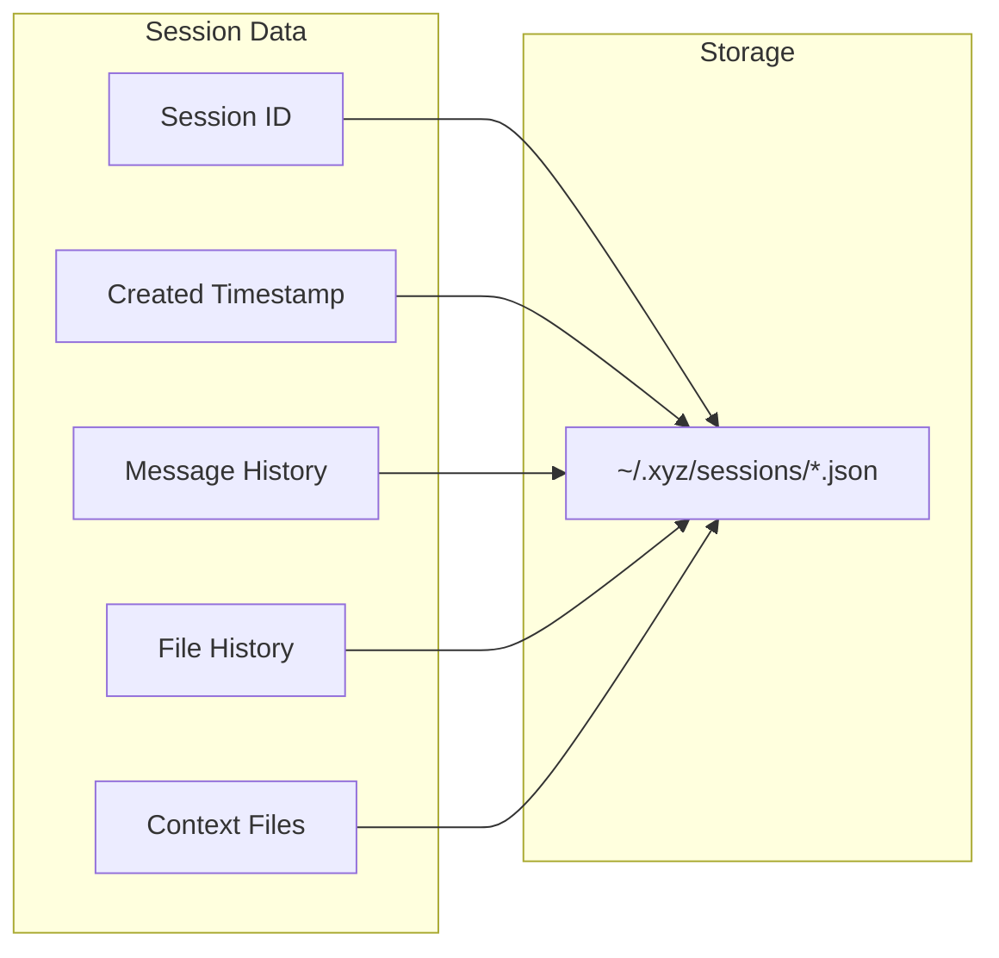

# XYZ - Agentic AI Coding CLI

> A powerful, terminal-based agentic AI coding assistant powered by NVIDIA NIM API.

XYZ is a CLI tool that brings AI-powered coding assistance directly to your terminal. It features tool-calling capabilities, session memory, Claude Code-inspired UI, and a local gateway that proxies requests to NVIDIA's NIM API with streaming support, caching, and token tracking.

---

## Table of Contents

- [Features](#features)
- [Architecture](#architecture)
- [Project Structure](#project-structure)
- [Installation](#installation)
- [Quick Start](#quick-start)
- [Commands](#commands)
- [Slash Commands](#slash-commands)
- [Themes](#themes)
- [Agent Tools](#agent-tools)
- [Safety System](#safety-system)
- [Session Management](#session-management)
- [Gateway API](#gateway-api)
- [Configuration](#configuration)
- [Development](#development)
- [Created By](#created-by)

---

## Features

- **Agentic Tool Calling** - AI can read/write files, execute shell commands, search code, and list directories
- **Streaming Responses** - Real-time token-by-token output from the model
- **Session Memory** - Persistent conversations with file history tracking and undo support
- **Safety First** - Hard-blocked dangerous commands with confirmation prompts for unknown operations
- **Claude Code-Inspired UI** - Clean header, tips panel, what's new section, and organized command list
- **Themeable UI** - 6 built-in themes including Claude-inspired default theme
- **Model Discovery** - Automatically discovers available models from NVIDIA NIM
- **Response Caching** - LRU cache for faster repeated queries
- **Token Tracking** - Monitor prompt/completion token usage across sessions
- **Trust Mode** - Toggle confirmation prompts for experienced users
- **Status Bar** - Real-time activity indicator showing current state (thinking, reading, writing, executing)
- **Interactive Model Picker** - Browse and select from available models

---

## Architecture



### Request Flow

```mermaid
sequenceDiagram
    participant U as User
    participant CLI as CLI (main.py)
    participant UI as TerminalUI
    participant P as AgentPlanner
    participant G as Gateway (FastAPI)
    participant NIM as NVIDIA NIM API
    participant M as SessionMemory

    U->>CLI: Type message
    CLI->>UI: Display input
    CLI->>P: process(user_input, model)
    P->>M: Add user message
    P->>G: POST /v1/chat (stream)
    G->>NIM: Forward request with tools
    NIM-->>G: Stream chunks
    G-->>P: SSE events (tokens/tool_calls)
    P->>UI: Stream tokens to terminal

    alt Tool Call Detected
        P->>Parser: Parse tool call
        P->>Safety: Check command safety
        alt Blocked
            Safety-->>P: BLOCKED
            P->>UI: Show blocked message
        alt Needs Confirmation
            Safety-->>P: CONFIRM
            P->>UI: Ask user [y/n]
        else Safe / Trusted
            P->>Tools: Execute tool
            Tools-->>P: Result
            P->>UI: Display result
            P->>M: Track file write
            P->>G: Send tool result
            G->>NIM: Continue conversation
            NIM-->>G: Next response
            G-->>P: Stream response
            P->>UI: Stream output
        end
    else No Tool Call
        P->>M: Save assistant message
    end

    P-->>CLI: Done
    CLI->>UI: Show separator
```

---

## Project Structure

```
xyz/
├── main.py              # CLI entry point (Typer)
├── config.py            # Configuration, API key, sessions
├── __init__.py          # Package metadata
├── agent/
│   ├── planner.py       # Agent loop with tool orchestration
│   ├── memory.py        # Session memory with file history
│   ├── parser.py        # Multi-format tool call parser
│   ├── safety.py        # Command safety checker
│   └── tools.py         # Tool implementations & registry
├── gateway/
│   ├── app.py           # FastAPI gateway server
│   ├── providers.py     # NVIDIA NIM API provider
│   └── cache.py         # LRU response cache
├── ui/
│   ├── terminal.py      # Rich-based terminal UI (Claude Code-inspired)
│   └── themes.py        # Theme definitions
└── utils/
    └── files.py         # Git context & file tree utilities
```

---

## Installation

### Prerequisites

- Python 3.10+
- NVIDIA NIM API key (get one at [build.nvidia.com](https://build.nvidia.com))

### Setup

```bash
# Clone or navigate to the project directory
cd xyz

# Install dependencies
pip install -r requirements.txt

# Install as editable package
pip install -e .

# Initialize with your API key
xyz init
```

### Dependencies

| Package | Purpose |
|---------|---------|
| `typer` | CLI framework |
| `rich` | Terminal UI rendering |
| `httpx` | Async HTTP client |
| `fastapi` | Gateway server |
| `uvicorn` | ASGI server |
| `pydantic` | Data validation |
| `orjson` | Fast JSON parsing |
| `keyring` | Secure API key storage |
| `prompt_toolkit` | Interactive model picker |

---

## Quick Start

```bash
# Initialize XYZ (first time only)
xyz init
# Enter your NVIDIA NIM API key when prompted

# Start a chat session
xyz chat

# Or just run xyz (defaults to chat)
xyz

# Use a specific model
xyz chat --model meta/llama-3.3-70b-instruct

# Resume a previous session
xyz chat --session abc12345
```

---

## Commands

| Command | Description |
|---------|-------------|
| `xyz init` | Initialize and set up API key |
| `xyz chat` | Start interactive chat session |
| `xyz run` | Start chat (alias for `chat`) |
| `xyz models` | List available models |
| `xyz sessions` | List saved sessions |
| `xyz themes` | List and set themes |
| `xyz undo <session-id>` | Undo last file write in a session |

### Chat Options

```
xyz chat [OPTIONS]

Options:
  -m, --model TEXT       Model to use
  -s, --session TEXT     Session ID to resume
```

---

## Slash Commands

While in a chat session, use these commands:

| Command | Description |
|---------|-------------|
| `/help` | Show all available commands |
| `/model` | Interactive model picker (browse and select from available models) |
| `/models` | List all available models |
| `/themes [name]` | List or set a theme |
| `/trust [on/off]` | Toggle trust mode for commands |
| `/sessions` | List saved sessions |
| `/resume <id>` | Resume a previous session |
| `/context` | Show repository context summary |
| `/clear` | Clear conversation history |
| `/compact` | Summarize and compress context |
| `/export` | Export conversation to markdown |
| `/undo` | Undo last file change |
| `/exit` | Exit XYZ |
| `/config` | Open config panel |
| `/diff` | View uncommitted changes |
| `/doctor` | Diagnose XYZ installation |
| `/effort` | Set effort level for model usage |
| `/fast` | Toggle fast mode |
| `/feedback` | Submit feedback |
| `/focus` | Toggle focus view |
| `/goal` | Set a goal for the session |
| `/hooks` | View hook configurations |
| `/ide` | Manage IDE integrations |
| `/keybindings` | Configure keybindings |
| `/login` | Sign in |
| `/logout` | Sign out |
| `/branch` | Create a conversation branch |
| `/background` | Send session to background |
| `/btw` | Ask a side question |
| `/copy` | Copy last response |
| `/advisor` | Configure Advisor Tool |
| `/agents` | Manage agent configurations |
| `/color` | Set prompt bar color |
| `/install-github-app` | Set up GitHub Actions |
| `/add-dir` | Add a working directory |

---

## Status Bar

XYZ displays a live status bar at the bottom of the terminal showing current activity:

```
● Ready  ·  llama-3.3-70b-instruct
⠋ Thinking  ·  llama-3.3-70b-instruct
 Reading  · read_file  ·  llama-3.3-70b-instruct
✏️ Writing  · write_file  ·  llama-3.3-70b-instruct
⚡ Executing  · execute_shell  ·  llama-3.3-70b-instruct
🔍 Searching  · search_files  ·  llama-3.3-70b-instruct
```

The status bar updates in real-time as the agent works.

---

## Interactive Model Picker

Type `/model` in chat to open an interactive model selector:

```
Select model
Switch models. Applies to this session.

  1. meta/llama-3.3-70b-instruct ✓
  2. deepseek-ai/deepseek-coder-6.7b-instruct
  3. google/gemma-2-2b-it
  4. mistralai/mistral-7b-instruct-v0.3
  ...

Enter number to select, or 'q' to cancel
>
```

---

## Themes

XYZ ships with 6 built-in themes:

| Theme | Description |
|-------|-------------|
| **claude** | Claude Code inspired - warm copper/orange tones (default) |
| **midnight** | Deep dark blues and soft whites |
| **obsidian** | Pure dark with warm accents |
| **aurora** | Northern lights inspired greens and purples |
| **solarized** | Classic solarized dark palette |
| **monokai** | Vibrant monokai colors |

Change theme in-chat with `/themes <name>` or via the `xyz themes` command.

---

## Agent Tools

The agent has access to these tools during conversations:



### Tool Details

| Tool | Description | Parameters |
|------|-------------|------------|
| `read_file` | Read file contents (truncated to 10KB) | `path` |
| `write_file` | Write/create a file (creates parent dirs) | `path`, `content` |
| `list_directory` | List directory entries | `path` |
| `execute_shell` | Run shell command (60s timeout) | `command` |
| `search_files` | Search for patterns in code files | `pattern`, `path` |

---

## Safety System

XYZ includes a multi-layer safety system for shell command execution:



### Blocked Categories

- **Destructive**: `rm -rf /`, `mkfs`, `dd`, `format`
- **Privilege Escalation**: `sudo` commands
- **System Control**: `shutdown`, `reboot`
- **Remote Execution**: `curl | bash`, `wget | sh`
- **Fork Bombs**: `:(){ :|:& };:`

---

## Session Management

Sessions are automatically saved and can be resumed:



### File History & Undo

Every file write is tracked in session memory, enabling undo:

```
xyz undo <session-id>
```

Or in-chat: `/undo`

---

## Gateway API

The local gateway runs on a free port and provides these endpoints:

| Endpoint | Method | Description |
|----------|--------|-------------|
| `/health` | GET | Health check |
| `/v1/chat` | POST | Streaming chat completion |
| `/v1/chat/non-stream` | POST | Non-streaming chat completion |
| `/v1/models` | GET | List available models |
| `/v1/stats` | GET | Token usage and cache stats |
| `/v1/cache/clear` | POST | Clear response cache |

### Streaming Protocol

The gateway uses Server-Sent Events (SSE):

```
data: {"type":"token","data":"Hello"}
data: {"type":"token","data":" world"}
data: {"type":"tool_call","data":"{...}"}
data: {"type":"usage","data":"{...}"}
data: {"type":"done","content":"Hello world","tool_calls":[],"usage":{...}}
```

---

## Configuration

Configuration is stored at `~/.xyz/config.json`:

```json
{
  "api_key_set": true,
  "default_model": "meta/llama-3.3-70b-instruct",
  "vision_model": "meta/llama-3.2-90b-vision-instruct",
  "gateway_port": 0,
  "trust_mode": false,
  "theme": "claude",
  "discovered_models": [],
  "last_model_fetch": null
}
```

API keys are stored securely in your OS keyring (not in the config file).

### Default Models

| Model | Provider |
|-------|----------|
| `meta/llama-3.3-70b-instruct` | Meta (default) |
| `meta/llama-3.1-405b-instruct` | Meta |
| `meta/llama-3.1-70b-instruct` | Meta |
| `meta/llama-3.1-8b-instruct` | Meta |
| `qwen/qwen-2.5-coder-32b-instruct` | Alibaba |
| `qwen/qwen-2.5-72b-instruct` | Alibaba |
| `microsoft/phi-4` | Microsoft |
| `google/gemma-2-27b-it` | Google |
| `mistralai/mistral-large-2-instruct` | Mistral AI |
| `deepseek-ai/deepseek-r1` | DeepSeek |

---

## Development

### Running from Source

```bash
# Install in editable mode
pip install -e .

# Run directly
python -m xyz.main

# Or use the entry point
xyz
```

### Running Tests

```bash
pytest tests/
```

### Adding a New Tool

1. Add tool definition to `TOOL_DEFINITIONS` in `agent/tools.py`
2. Implement the function in `agent/tools.py`
3. Register in `TOOL_REGISTRY`
4. Update `SYSTEM_PROMPT` in `agent/planner.py`
5. Add to `tool_names` in `agent/parser.py`

### Adding a New Theme

Add a new `Theme` entry to `THEMES` dict in `ui/themes.py`:

```python
"mytheme": Theme(
    name="My Theme",
    description="Custom theme",
    primary="bold cyan",
    secondary="green",
    # ... other fields
)
```

---

## Changelog

### v0.1.0

- Initial release
- Claude Code-inspired UI with clean header, tips panel, and what's new section
- 6 built-in themes including Claude-inspired default
- Agentic tool calling with safety system
- Session memory with file history and undo
- Streaming responses from NVIDIA NIM API
- Interactive model picker
- Token tracking and response caching

---

## Created By

**Kumar Satyam**
- Email: kumarsatyam3135@gmail.com
